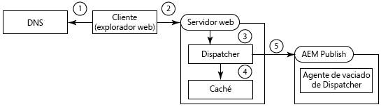
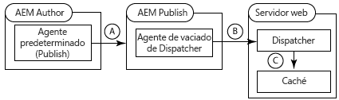
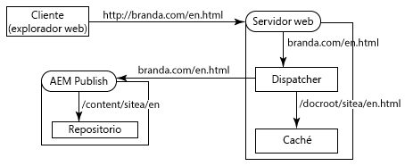
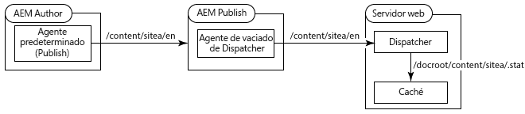
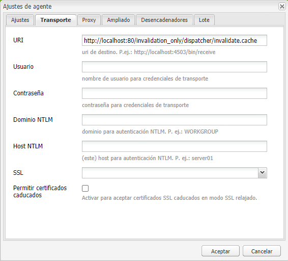
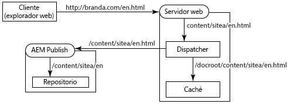
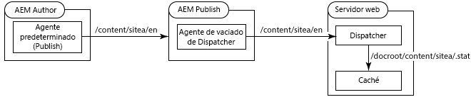
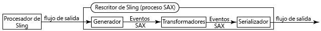
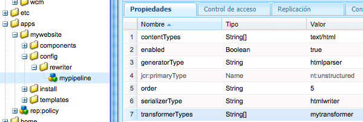

# Uso de Dispatcher con varios dominios {#using-dispatcher-with-multiple-domains}

>[!NOTE]
>
>Las versiones de Dispatcher son independientes de AEM. Es posible que se le haya redirigido a esta página si ha seguido un vínculo a la documentación de Dispatcher incrustada en la documentación de AEM o CQ.

Utilice Dispatcher para procesar solicitudes de página en varios dominios web mientras se admiten las siguientes condiciones:

* El contenido web de ambos dominios se almacena en un único repositorio de AEM.
* Los archivos de la caché de Dispatcher se pueden invalidar por separado para cada dominio.

Por ejemplo, una empresa publica sitios web para dos de sus marcas: Marca A y Marca B. El contenido de las páginas del sitio web se crea en AEM y se almacena en el mismo espacio de trabajo del repositorio:

```
/
| - content  
   | - sitea  
       | - content nodes  
   | - siteb  
       | - content nodes
```

Las páginas para `BrandA.com` se almacenan a continuación `/content/sitea`. Las solicitudes de cliente para la URL `https://BrandA.com/en.html` se devuelven a la página representada para el `/content/sitea/en` nodo. Del mismo modo, las páginas para `BrandB.com` se almacenan a continuación `/content/siteb`.

Al utilizar Dispatcher para almacenar en caché el contenido, se deben realizar asociaciones entre la dirección URL de la página en la solicitud HTTP del cliente, la ruta del archivo correspondiente en la caché y la ruta del archivo correspondiente en el repositorio.

## Solicitudes del cliente

Cuando los clientes envían solicitudes HTTP al servidor web, la dirección URL de la página solicitada debe resolverse con el contenido de la caché de Dispatcher y, finalmente, con el contenido del repositorio.



1. El sistema de nombres de dominio detecta la dirección IP del servidor web que está registrado para el nombre de dominio en la solicitud HTTP.
1. La solicitud HTTP se envía al servidor web.
1. La solicitud HTTP se pasa a Dispatcher.
1. Dispatcher determina si los archivos en caché son válidos. Si es válido, los archivos en caché se sirven al cliente.
1. Si los archivos en caché no son válidos, Dispatcher solicita las páginas recién procesadas de la instancia de publicación de AEM.

## Invalidación de caché

Cuando los agentes de replicación de Dispatcher Flush solicitan que Dispatcher invalide los archivos en caché, la ruta del contenido en el repositorio debe resolverse en el contenido de la caché.



1. Se activa una página en la instancia de creación de AEM y el contenido se replica en la instancia de publicación.
1. Dispatcher Flush Agent llama a Dispatcher para invalidar la caché del contenido replicado.
1. Dispatcher toca uno o varios archivos .stat para invalidar los archivos en caché.

Para utilizar Dispatcher con varios dominios, debe configurar AEM, Dispatcher y su servidor web. Las soluciones descritas en esta página son generales y se aplican a la mayoría de los entornos. Debido a la complejidad de algunas topologías de AEM, su solución puede requerir más configuraciones personalizadas para resolver problemas específicos. Es probable que deba adaptar los ejemplos para satisfacer sus políticas de administración e infraestructura de TI existentes.

## Asignación de direcciones URL {#url-mapping}

Para permitir que las direcciones URL de dominio y las rutas de contenido se resuelvan en archivos en caché, en algún momento del proceso se debe traducir una ruta de archivo o una dirección URL de página. Se proporcionan descripciones de las siguientes estrategias comunes, donde las traducciones de ruta o URL se producen en diferentes puntos del proceso:

* (Recomendado) La instancia de publicación de AEM utiliza la asignación de Sling para la resolución de recursos a fin de implementar las reglas de reescritura de URL internas. Las direcciones URL de dominio se traducen a rutas de repositorio de contenido. (Consulte [AEM Reescribe las direcciones URL](#aem-rewrites-incoming-urls)entrantes).
* El servidor web utiliza reglas de reescritura de URL internas que traducen las direcciones URL de dominio a las rutas de caché. (Consulte [El servidor web reescribe las direcciones URL](#the-web-server-rewrites-incoming-urls)entrantes).

Por lo general, es recomendable utilizar direcciones URL cortas para las páginas web. Normalmente, las direcciones URL de las páginas reflejan la estructura de las carpetas del repositorio que contienen el contenido web. Sin embargo, las direcciones URL no revelan los nodos de repositorio superiores, como `/content`. El cliente no es necesariamente consciente de la estructura del repositorio de AEM.

## Requisitos generales {#general-requirements}

Su entorno debe implementar las siguientes configuraciones para admitir que Dispatcher funcione con varios dominios:

* El contenido de cada dominio reside en ramas independientes del repositorio (consulte el entorno de ejemplo a continuación).
* El agente de replicación Dispatcher Flush está configurado en la instancia de publicación de AEM. (Consulte [Invalidación de la caché de despachantes desde una instancia](page-invalidate.md)de publicación).
* El sistema de nombres de dominio resuelve los nombres de dominio en la dirección IP del servidor web.
* La caché de Dispatcher refleja la estructura de directorios del repositorio de contenido de AEM. Las rutas de archivo que se encuentran debajo de la raíz del documento del servidor Web son las mismas que las rutas de los archivos del repositorio.

## Entorno para los ejemplos proporcionados {#environment-for-the-provided-examples}

Las soluciones de ejemplo proporcionadas se aplican a un entorno con las siguientes características:

* Las instancias de creación y publicación de AEM se implementan en sistemas Linux.
* Apache HTTPD es el servidor web, implementado en un sistema Linux.
* El repositorio de contenido de AEM y la raíz del documento del servidor web utilizan las siguientes estructuras de archivos (la raíz del documento del servidor web Apache es /`usr/lib/apache/httpd-2.4.3/htdocs)`:

   **Repositorio**

```
  | - /content  
    | - sitea  
  |    | - content nodes 
    | - siteb  
       | - conent nodes
```

**Raíz de documento del servidor web**

```
  | - /usr  
    | - lib  
      | - apache  
        | - httpd-2.4.3  
          | - htdocs  
            | - content  
              | - sitea  
                 | - content nodes 
              | - siteb  
                 | - content nodes
```

## AEM reescribe las direcciones URL entrantes {#aem-rewrites-incoming-urls}

La asignación de Sling para la resolución de recursos le permite asociar las direcciones URL entrantes con las rutas de contenido de AEM. Cree asignaciones en la instancia de publicación de AEM para que las solicitudes de procesamiento de Dispatcher se resuelvan en el contenido correcto del repositorio.

Las solicitudes de Distribuidor para la representación de página identifican la página utilizando la dirección URL que se pasa desde el servidor web. Cuando la dirección URL incluye un nombre de dominio, las asignaciones de Sling resuelven la dirección URL del contenido. El siguiente gráfico ilustra una asignación de la `branda.com/en.html` URL al `/content/sitea/en` nodo.



La caché de Dispatcher refleja la estructura de nodos del repositorio. Por lo tanto, cuando se producen activaciones de página, las solicitudes resultantes de invalidar la página en caché no requieren traducciones de dirección URL o ruta.



## Definir hosts virtuales en el servidor web {#define-virtual-hosts-on-the-web-server}

Defina hosts virtuales en el servidor web para que se pueda asignar una raíz de documento diferente a cada dominio web:

* El servidor web debe definir un dominio virtual para cada uno de los dominios web.
* Para cada dominio, configure la raíz del documento para que coincida con la carpeta del repositorio que contiene el contenido web del dominio.
* Cada dominio virtual también debe incluir configuraciones relacionadas con Dispatcher, como se describe en la página [Instalación de Dispatcher](dispatcher-install.md) .

El siguiente archivo de ejemplo `httpd.conf` configura dos dominios virtuales para un servidor web Apache:

* Los nombres de servidor (que coinciden con los nombres de dominio) son branda.com (línea 16) y brandb.com (línea 30).
* La raíz del documento de cada dominio virtual es el directorio de la caché de Dispatcher que contiene las páginas del sitio. (líneas 17 y 31)

Con esta configuración, el servidor web realiza las siguientes acciones cuando recibe una solicitud de `https://branda.com/en/products.html`:

* Asocia la dirección URL con el host virtual que tiene un `ServerName` de `branda.com.`

* Reenvía la dirección URL a Dispatcher.

### httpd.conf {#httpd-conf}

```xml
# load the Dispatcher module
LoadModule dispatcher_module modules/mod_dispatcher.so
# configure the Dispatcher module
<IfModule disp_apache2.c>
 DispatcherConfig conf/dispatcher.any
 DispatcherLog    logs/dispatcher.log  
 DispatcherLogLevel 3
 DispatcherNoServerHeader 0 
 DispatcherDeclineRoot 0
 DispatcherUseProcessedURL 0
 DispatcherPassError 0
</IfModule>

# Define virtual host for brandA.com
<VirtualHost *:80>
  ServerName branda.com
  DocumentRoot /usr/lib/apache/httpd-2.4.3/htdocs/content/sitea
   <Directory /usr/lib/apache/httpd-2.4.3/htdocs/content/sitea>
     <IfModule disp_apache2.c>
       SetHandler dispatcher-handler
       ModMimeUsePathInfo On
     </IfModule>
     Options FollowSymLinks
     AllowOverride None
   </Directory>
</VirtualHost>

# define virtual host for brandB.com
<VirtualHost *:80>
  ServerName brandB.com
  DocumentRoot /usr/lib/apache/httpd-2.4.3/htdocs/content/siteb
   <Directory /usr/lib/apache/httpd-2.4.3/htdocs/content/siteb>
     <IfModule disp_apache2.c>
       SetHandler dispatcher-handler
       ModMimeUsePathInfo On
     </IfModule>
     Options FollowSymLinks
     AllowOverride None
   </Directory>
</VirtualHost>

# document root for web server
DocumentRoot "/usr/lib/apache/httpd-2.4.3/htdocs"
```

Tenga en cuenta que los hosts virtuales heredan el valor de la propiedad [DispatcherConfig](dispatcher-install.md#main-pars-67-table-7) configurado en la sección del servidor principal. Los hosts virtuales pueden incluir su propia propiedad DispatcherConfig para anular la configuración del servidor principal.

### Configurar Dispatcher para que gestione varios dominios {#configure-dispatcher-to-handle-multiple-domains}

Para admitir direcciones URL que incluyan nombres de dominio y sus hosts virtuales correspondientes, defina los siguientes conjuntos de Dispatcher:

* Configure una granja de Dispatcher para cada host virtual. Estas granjas procesan solicitudes del servidor web para cada dominio, buscan archivos en caché y solicitan páginas de los procesamientos.
* Configure un conjunto de servidores Dispatcher que se utilice para invalidar el contenido de la caché, independientemente del dominio al que pertenezca el contenido. Este conjunto de servidores gestiona las solicitudes de invalidación de archivos de los agentes de replicación de Dispatcher de vaciado.

### Crear granjas de despachantes para hosts virtuales

Los conjuntos de servidores para hosts virtuales deben tener las configuraciones siguientes para que las direcciones URL de las solicitudes HTTP del cliente se resuelvan en los archivos correctos en la caché de Dispatcher:

* La `/virtualhosts` propiedad se establece en el nombre del dominio. Esta propiedad permite a Dispatcher asociar la granja con el dominio.
* La `/filter` propiedad permite acceder a la ruta de la URL de solicitud truncada después de la parte del nombre de dominio. Por ejemplo, para la `https://branda.com/en.html` URL, la ruta se interpreta como `/en.html`, por lo que el filtro debe permitir el acceso a esta ruta.

* La `/docroot` propiedad se establece en la ruta del directorio raíz del contenido del sitio del dominio en la caché de Dispatcher. Esta ruta se utiliza como prefijo para la dirección URL concatenada de la solicitud original. Por ejemplo, el docroot de `/usr/lib/apache/httpd-2.4.3/htdocs/sitea` hace que la solicitud de `https://branda.com/en.html` resolución del `/usr/lib/apache/httpd-2.4.3/htdocs/sitea/en.html` archivo.

Además, la instancia de publicación de AEM debe designarse como el procesamiento del host virtual. Configure otras propiedades de granja de servidores según sea necesario. El siguiente código es una configuración de granja abreviada para el dominio branda.com:

```xml
/farm_sitea  {     
    ...
    /virtualhosts { "branda.com" }
    /renders {
      /rend01  { /hostname "127.0.0.1"  /port "4503" }
    }
    /filter {
      /0001 { /type "deny"  /glob "*" }
      /0023 { /type "allow" /glob "*/en*" }  
      ...
     }
    /cache {
      /docroot "/usr/lib/apache/httpd-2.4.3/htdocs/content/sitea"
      ...
   }
   ...
}
```

### Crear una granja de Dispatcher para invalidar la caché

Se requiere un conjunto de servidores Dispatcher para gestionar solicitudes de invalidación de archivos en caché. Este conjunto de servidores debe poder acceder a los archivos .stat en los directorios docroot de cada host virtual.

Las siguientes configuraciones de propiedad permiten a Dispatcher resolver archivos del repositorio de contenido de AEM de archivos de la caché:

* La `/docroot` propiedad se establece en la raízDeDocumento predeterminada del servidor web. Normalmente, este es el directorio en el que se crea la `/content` carpeta. Un valor de ejemplo para Apache en Linux es `/usr/lib/apache/httpd-2.4.3/htdocs`.
* La `/filter` propiedad permite acceder a los archivos situados debajo del `/content` directorio.

La `/statfileslevel`propiedad debe ser lo suficientemente alta como para que los archivos .stat se creen en el directorio raíz de cada host virtual. Esta propiedad permite que la caché de cada dominio se invalide por separado. Para la configuración de ejemplo, un `/statfileslevel` valor de `2` crea archivos .stat en el `*docroot*/content/sitea` directorio y en el `*docroot*/content/siteb` directorio.

Además, la instancia de publicación debe designarse como el procesamiento del host virtual. Configure otras propiedades de granja de servidores según sea necesario. El siguiente código es una configuración abreviada para la granja de servidores que se utiliza para invalidar la caché:

```xml
/farm_flush {  
    ...
    /virtualhosts   { "invalidation_only" }
    /renders  {
      /rend01  { /hostname "127.0.0.1" /port "4503" }
    }
    /filter   {
      /0001 { /type "deny"  /glob "*" }
      /0023 { /type "allow" /glob "*/content*" } 
      ...
      }
    /cache  {
       /docroot "/usr/lib/apache/httpd-2.4.3/htdocs"
       /statfileslevel "2"
       ...
   }
   ...
}
```

Al iniciar el servidor web, el registro de Dispatcher (en modo de depuración) indica la inicialización de todos los conjuntos:

```shell
Dispatcher initializing (build 4.1.2)
[Fri Nov 02 16:27:18 2012] [D] [24974(140006182991616)] farms[farm_sitea].cache.docroot = /usr/lib/apache/httpd-2.4.3/htdocs/content/sitea
[Fri Nov 02 16:27:18 2012] [D] [24974(140006182991616)] farms[farm_siteb].cache.docroot = /usr/lib/apache/httpd-2.4.3/htdocs/content/siteb
[Fri Nov 02 16:27:18 2012] [D] [24974(140006182991616)] farms[farm_flush].cache.docroot = /usr/lib/apache/httpd-2.4.3/htdocs
[Fri Nov 02 16:27:18 2012] [I] [24974(140006182991616)] Dispatcher initialized (build 4.1.2)
```

### Configurar la asignación de Sling para la resolución de recursos {#configure-sling-mapping-for-resource-resolution}

Utilice la asignación de Sling para la resolución de recursos de modo que las URL basadas en dominios se resuelvan en el contenido de la instancia de publicación de AEM. La asignación de recursos traduce las direcciones URL entrantes de Dispatcher (originalmente desde solicitudes HTTP del cliente) a nodos de contenido.

Para obtener más información sobre la asignación de recursos de Sling, consulte [Asignaciones para la resolución](https://sling.apache.org/site/mappings-for-resource-resolution.html) de recursos en la documentación de Sling.

Normalmente, las asignaciones son necesarias para los siguientes recursos, aunque pueden ser necesarias asignaciones adicionales:

* El nodo raíz de la página de contenido (debajo `/content`)
* El nodo de diseño que utilizan las páginas (debajo `/etc/designs`)
* La `/libs` carpeta

Después de crear la asignación para la página de contenido, para descubrir asignaciones adicionales necesarias, utilice un navegador web para abrir una página en el servidor web. En el archivo error.log de la instancia de publicación, busque mensajes sobre los recursos que no se encuentran. El siguiente mensaje de ejemplo indica que `/etc/clientlibs` se requiere una asignación para:

```shell
01.11.2012 15:59:24.601 *INFO* [10.36.34.243 [1351799964599] GET /etc/clientlibs/foundation/jquery.js HTTP/1.1] org.apache.sling.engine.impl.SlingRequestProcessorImpl service: Resource /content/sitea/etc/clientlibs/foundation/jquery.js not found
```

>[!NOTE]
>
>El transformador del comprobador de vínculos del reescritor Apache Sling predeterminado modifica automáticamente los hipervínculos de la página para evitar que se rompan los vínculos. Sin embargo, la reescritura de vínculos solo se realiza cuando el destino del vínculo es un archivo HTML o HTM. Para actualizar los vínculos a otros tipos de archivo, cree un componente de transformador y agréguelo a una canalización de reescritura HTML.

### Ejemplos de nodos de asignación de recursos

La siguiente tabla enumera los nodos que implementan la asignación de recursos para el dominio branda.com. Se crean nodos similares para el `brandb.com` dominio, como `/etc/map/http/brandb.com`. En todos los casos, las asignaciones son necesarias cuando las referencias en el HTML de la página no se resuelven correctamente en el contexto de Sling.

| Ruta de nodo | Tipo | Propiedad |
|--- |--- |--- |
| `/etc/map/http/branda.com` | sling:Mapping | Nombre: sling:internalRedirect Type: Valor de cadena: /content/sitea |
| `/etc/map/http/branda.com/libs` | sling:Mapping | Nombre: sling:internalRedirect <br/>Type: Valor <br/>de cadena: /libs |
| `/etc/map/http/branda.com/etc` | sling:Mapping |  |
| `/etc/map/http/branda.com/etc/designs` | sling:Mapping | Nombre: sling:internalRedirect <br/>VType: Valor <br/>de cadena: /etc/designs |
| `/etc/map/http/branda.com/etc/clientlibs` | sling:Mapping | Nombre: sling:internalRedirect <br/>VType: Valor <br/>de cadena: /etc/clientlibs |

## Configuración del agente de replicación Dispatcher Flush {#configuring-the-dispatcher-flush-replication-agent}

El agente de replicación Dispatcher Flush de la instancia de publicación de AEM debe enviar solicitudes de invalidación al conjunto de servidores Dispatcher correcto. Para dirigirse a un conjunto de servidores, utilice la propiedad URI del agente de replicación Dispatcher Flush (en la ficha Transporte). Incluya el valor de la `/virtualhost` propiedad para el conjunto de servidores Dispatcher configurado para invalidar la caché:

`https://*webserver_name*:*port*/*virtual_host*/dispatcher/invalidate.cache`

Por ejemplo, para utilizar la `farm_flush` granja del ejemplo anterior, el URI es `https://localhost:80/invalidation_only/dispatcher/invalidate.cache`.



## El servidor web reescribe las direcciones URL entrantes {#the-web-server-rewrites-incoming-urls}

Utilice la función de reescritura de direcciones URL internas del servidor web para traducir direcciones URL basadas en dominios a rutas de archivos en la caché de Dispatcher. Por ejemplo, las solicitudes de cliente para la `https://brandA.com/en.html` página se traducen al `content/sitea/en.html`archivo en la raíz del documento del servidor web.



La caché de Dispatcher refleja la estructura de nodos del repositorio. Por lo tanto, cuando se producen activaciones de página, las solicitudes resultantes para invalidar la página en caché no requieren traducciones de ruta o URL.



## Definir hosts virtuales y reescribir reglas en el servidor Web {#define-virtual-hosts-and-rewrite-rules-on-the-web-server}

Configure los siguientes aspectos en el servidor web:

* Defina un host virtual para cada uno de los dominios web.
* Para cada dominio, configure la raíz del documento para que coincida con la carpeta del repositorio que contiene el contenido web del dominio.
* Para cada dominio virtual, cree una regla de cambio de nombre de URL que traduzca la dirección URL entrante a la ruta del archivo en caché.
* Cada dominio virtual también debe incluir configuraciones relacionadas con Dispatcher, como se describe en la página [Instalación de Dispatcher](dispatcher-install.md) .
* El módulo Dispatcher debe configurarse para utilizar la dirección URL que el servidor web ha reescrito. (Consulte la `DispatcherUseProcessedURL` propiedad en [Instalación de Dispatcher](dispatcher-install.md)).

El siguiente ejemplo de archivo httpd.conf configura dos hosts virtuales para un servidor web Apache:

* Los nombres de servidor (que coinciden con los nombres de dominio) son `brandA.com` (línea 16) y `brandB.com` (línea 32).

* La raíz del documento de cada dominio virtual es el directorio de la caché de Dispatcher que contiene las páginas del sitio. (líneas 20 y 33)
* La regla de reescritura de la dirección URL para cada dominio virtual es una expresión regular que antepone la ruta de la página solicitada a la ruta de las páginas en la caché. (líneas 19 y 35)
* La `DispatherUseProcessedURL` propiedad se establece en `1`. (línea 10)

Por ejemplo, el servidor web realiza las siguientes acciones cuando recibe una solicitud con la `https://brandA.com/en/products.html` URL:

* Asocia la dirección URL con el host virtual que tiene un `ServerName` de `brandA.com.`
* Reescribe la dirección URL para `/content/sitea/en/products.html.`
* Reenvía la dirección URL a Dispatcher.

### httpd.conf {#httpd-conf-1}

```xml
# load the Dispatcher module
LoadModule dispatcher_module modules/mod_dispatcher.so
# configure the Dispatcher module
<IfModule disp_apache2.c>
 DispatcherConfig conf/dispatcher.any
 DispatcherLog    logs/dispatcher.log  
 DispatcherLogLevel 3
 DispatcherNoServerHeader 0 
 DispatcherDeclineRoot 0
 DispatcherUseProcessedURL 1
 DispatcherPassError 0
</IfModule>

# Define virtual host for brandA.com
<VirtualHost *:80>
  ServerName branda.com
  DocumentRoot /usr/lib/apache/httpd-2.4.3/htdocs/content/sitea
  RewriteEngine  on
  RewriteRule    ^/(.*)\.html$  /content/sitea/$1.html [PT]
   <Directory /usr/lib/apache/httpd-2.4.3/htdocs/content/sitea>
     <IfModule disp_apache2.c>
       SetHandler dispatcher-handler
       ModMimeUsePathInfo On
     </IfModule>
     Options FollowSymLinks
     AllowOverride None
   </Directory>
</VirtualHost>

# define virtual host for brandB.com
<VirtualHost *:80>
  ServerName brandB.com
  DocumentRoot /usr/lib/apache/httpd-2.4.3/htdocs/content/siteb
  RewriteEngine  on
  RewriteRule    ^/(.*)\.html$  /content/siteb/$1.html [PT]
   <Directory /usr/lib/apache/httpd-2.4.3/htdocs/content/siteb>
     <IfModule disp_apache2.c>
       SetHandler dispatcher-handler
       ModMimeUsePathInfo On
     </IfModule>
     Options FollowSymLinks
     AllowOverride None
   </Directory>
</VirtualHost>

# document root for web server
DocumentRoot "/usr/lib/apache/httpd-2.4.3/htdocs"
```

### Configurar una granja de despachantes {#configure-a-dispatcher-farm}

Cuando el servidor web vuelve a escribir las direcciones URL, Dispatcher requiere un único conjunto de servidores definido según la [configuración de Dispatcher](dispatcher-configuration.md). Las siguientes configuraciones son necesarias para admitir los hosts virtuales del servidor web y las reglas de cambio de nombre de URL:

* La `/virtualhosts` propiedad debe incluir los valores ServerName para todas las definiciones de VirtualHost.
* La `/statfileslevel` propiedad debe ser lo suficientemente alta como para crear archivos .stat en los directorios que contengan los archivos de contenido para cada dominio.

El siguiente archivo de configuración de ejemplo se basa en el archivo de ejemplo `dispatcher.any` que se instala con Dispatcher. Se requieren los siguientes cambios para admitir las configuraciones del servidor web del `httpd.conf` archivo anterior:

* La `/virtualhosts` propiedad hace que Dispatcher gestione solicitudes para los `brandA.com` dominios y `brandB.com` . (línea 12)
* La `/statfileslevel` propiedad se establece en 2, de modo que los archivos stat se crean en cada directorio que contiene el contenido web del dominio (línea 41): `/statfileslevel "2"`

Como de costumbre, la raíz del documento de la caché es la misma que la raíz del documento del servidor web (línea 40): `/usr/lib/apache/httpd-2.4.3/htdocs`

### `dispatcher.any` {#dispatcher-any}

```xml
/name "testDispatcher"
/farms
  {
  /dispfarm0
    {  
    /clientheaders
      {
      "*"
      }      
    /virtualhosts
      {
      "brandA.com" "brandB.com"
      }
    /renders
      {
      /rend01    {  /hostname "127.0.0.1"   /port "4503"  }
      }
    /filter
      {
      /0001 { /type "deny"  /glob "*" }
      /0023 { /type "allow" /glob "*/content*" }  # disable this rule to allow mapped content only
      /0041 { /type "allow" /glob "* *.css *"   }  # enable css
      /0042 { /type "allow" /glob "* *.gif *"   }  # enable gifs
      /0043 { /type "allow" /glob "* *.ico *"   }  # enable icos
      /0044 { /type "allow" /glob "* *.js *"    }  # enable javascript
      /0045 { /type "allow" /glob "* *.png *"   }  # enable png
      /0046 { /type "allow" /glob "* *.swf *"   }  # enable flash
      /0061 { /type "allow" /glob "POST /content/[.]*.form.html" }  # allow POSTs to form selectors under content
      /0062 { /type "allow" /glob "* /libs/cq/personalization/*"  }  # enable personalization
      /0081 { /type "deny"  /glob "GET *.infinity.json*" }
      /0082 { /type "deny"  /glob "GET *.tidy.json*"     }
      /0083 { /type "deny"  /glob "GET *.sysview.xml*"   }
      /0084 { /type "deny"  /glob "GET *.docview.json*"  }
      /0085 { /type "deny"  /glob "GET *.docview.xml*"  }      
      /0086 { /type "deny"  /glob "GET *.*[0-9].json*" }
      /0090 { /type "deny"  /glob "* *.query.json*" }
      }
    /cache
      {
      /docroot "/usr/lib/apache/httpd-2.4.3/htdocs"
      /statfileslevel "2"
      /allowAuthorized "0"
      /rules
        {
        /0000  { /glob "*"     /type "allow"  }
        }
      /invalidate
        {
        /0000  {   /glob "*" /type "deny"  }
        /0001 {  /glob "*.html" /type "allow"  }
        }
      /allowedClients
        {
        }     
      }
    /statistics
      {
      /categories
        {
        /html  { /glob "*.html" }
        /others  {  /glob "*"  }
        }
      }
    }
  }
```

>[!NOTE]
>
>Dado que se define un único conjunto de servidores Dispatcher, el agente de replicación Dispatcher Flush de la instancia de publicación de AEM no requiere ninguna configuración especial.

## Reescritura de vínculos a archivos que no son HTML {#rewriting-links-to-non-html-files}

Para reescribir referencias a archivos con extensiones distintas de .html o .htm, cree un componente de transformador de reescritor de Sling y agréguelo a la canalización de reescritores predeterminada.

Vuelva a escribir las referencias cuando las rutas de recursos no se resuelvan correctamente en el contexto del servidor web. Por ejemplo, se requiere un transformador cuando los componentes que generan imágenes crean vínculos como /content/sitea/en/products.navimage.png. El componente topnav del sitio web [Cómo crear un sitio web](https://helpx.adobe.com/experience-manager/6-3/sites/developing/using/the-basics.html) de Internet con todas las funciones crea estos vínculos.

El reescritor [](https://sling.apache.org/documentation/bundles/output-rewriting-pipelines-org-apache-sling-rewriter.html) Sling es un módulo que procesa la salida Sling después de su procesamiento. Las implementaciones de tubería SAX del reescritor consisten en un generador, uno o más transformadores y un serializador:

* **** Generador: Analiza el flujo de salida Sling (documento HTML) y genera eventos SAX cuando encuentra tipos de elementos específicos.
* **** Transformador: Presta atención a los eventos SAX y, en consecuencia, modifica el destino del evento (un elemento HTML). Una canalización de reescritura contiene cero o más transformadores. Los transformadores se ejecutan de forma secuencial, pasando los eventos SAX al siguiente transformador de la secuencia.
* **** Serializador: Serializa la salida, incluyendo las modificaciones de cada transformador.



### Canalización de reescritura predeterminada de AEM {#the-aem-default-rewriter-pipeline}

AEM utiliza un reescritor de canalización predeterminado que procesa documentos de tipo text/html:

* El generador analiza documentos HTML y genera eventos SAX cuando encuentra un elemento, img, area, form, base, link, script y body. El alias del generador es `htmlparser`.
* La canalización incluye los siguientes transformadores: `linkchecker`, `mobile`, `mobiledebug`, `contentsync`. El `linkchecker` transformador externaliza las rutas a archivos HTML o HTM a los que se hace referencia para evitar que se rompan los vínculos.
* El serializador escribe la salida HTML. El alias del serializador es htmlwriter.

El `/libs/cq/config/rewriter/default` nodo define la canalización.

### Creación de un transformador {#creating-a-transformer}

Realice las siguientes tareas para crear un componente de transformador y utilizarlo en una canalización:

1. Implementar la `org.apache.sling.rewriter.TransformerFactory` interfaz. Esta clase crea instancias de la clase de transformador. Especifique los valores de la `transformer.type` propiedad (el alias del transformador) y configure la clase como un componente de servicio OSGi.
1. Implementar la `org.apache.sling.rewriter.Transformer` interfaz. Para minimizar el trabajo, puede ampliar la `org.apache.cocoon.xml.sax.AbstractSAXPipe` clase. Anule el método startElement para personalizar el comportamiento de reescritura. Este método se llama para cada evento SAX que se pasa al transformador.
1. Agrupe e implemente las clases.
1. Agregue un nodo de configuración a la aplicación AEM para agregar el transformador a la canalización.

>[!TIP]
>En su lugar, puede configurar TransformerFactory para que el transformador se inserte en todos los reescritores definidos. Por lo tanto, no es necesario configurar una canalización:
>
>* Establezca la `pipeline.mode` propiedad en `global`.
>* Establezca la `service.ranking` propiedad en un entero positivo.
>* No incluya una `pipeline.type` propiedad.


>[!NOTE]
>
>Utilice el arquetipo [multimódulo](https://helpx.adobe.com/experience-manager/aem-previous-versions.html) del complemento Content Package Maven para crear su proyecto Maven. Los POM crean e instalan automáticamente un paquete de contenido.

Los siguientes ejemplos implementan un transformador que vuelve a escribir referencias en archivos de imagen.

* La clase MyRewriterTransformerFactory crea instancias de objetos MyRewriterTransformer. La propiedad peline.type establece el alias del transformador en mytransformer. Para incluir el alias en una canalización, el nodo de configuración de canalización incluye este alias en la lista de transformadores.
* La clase MyRewriterTransformer anula el método startElement de la clase AbstractSAXTransformer. El método startElement vuelve a escribir el valor de los atributos src para los elementos img.

Los ejemplos no son sólidos y no deben utilizarse en un entorno de producción.

### Ejemplo de implementación de TransformerFactory {#example-transformerfactory-implementation}

```java
package com.adobe.example;

import org.apache.felix.scr.annotations.Component;
import org.apache.felix.scr.annotations.Service;
import org.apache.felix.scr.annotations.Property;

import org.apache.sling.rewriter.Transformer;
import org.apache.sling.rewriter.TransformerFactory;

@Component
@Service
public class MyRewriterTransformerFactory implements TransformerFactory {
    /* Define the alias */
    @Property(value="mytransformer")
    static final String PIPELINE_TYPE ="pipeline.type";
 
    public Transformer createTransformer() {
        
        return new MyRewriterTransformer ();
    }
}
```

### Ejemplo de implementación de Transformador {#example-transformer-implementation}

```java
package com.adobe.example;

import java.io.IOException;

import org.apache.cocoon.xml.sax.AbstractSAXPipe;

import org.apache.sling.api.SlingHttpServletRequest;
import org.apache.sling.rewriter.ProcessingComponentConfiguration;
import org.apache.sling.rewriter.ProcessingContext;
import org.apache.sling.rewriter.Transformer;

import org.slf4j.Logger;
import org.slf4j.LoggerFactory;

import org.xml.sax.Attributes;
import org.xml.sax.SAXException;
import org.xml.sax.helpers.AttributesImpl;

import javax.servlet.http.HttpServletRequest;

public class MyRewriterTransformer extends AbstractSAXPipe implements Transformer {

 private static final Logger log = LoggerFactory.getLogger(MyRewriterTransformer.class);
 private SlingHttpServletRequest httpRequest; 
 /* The element and attribute to act on  */
 private static final String ATT_NAME = new String("src");
 private static final String EL_NAME = new String("img");

 public MyRewriterTransformer () {
 }
 public void dispose() {
 }
 public void init(ProcessingContext context, ProcessingComponentConfiguration config) throws IOException {
  this.httpRequest = context.getRequest();
  log.debug("Transforming request {}.", httpRequest.getRequestURI());
 }
 @Override
 public void startElement (String nsUri, String localname, String qname, Attributes atts) throws SAXException {
  /* copy the element attributes */
  AttributesImpl linkAtts = new AttributesImpl(atts); 
  /* Only interested in EL_NAME elements */
  if(EL_NAME.equalsIgnoreCase(localname)){

   /* iterate through the attributes of the element and act only on ATT_NAME attributes */
   for (int i=0; i < linkAtts.getLength(); i++) {
    if (ATT_NAME.equalsIgnoreCase(linkAtts.getLocalName(i))) {
     String path_in_link = linkAtts.getValue(i);

     /* use the resource resolver of the http request to reverse-resolve the path  */
     String mappedPath = httpRequest.getResourceResolver().map(httpRequest, path_in_link);

     log.info("Tranformed {} to {}.", path_in_link,mappedPath);

     /* update the attribute value */
     linkAtts.setValue(i,mappedPath);
    }
   }

  }
        /* return updated attributes to super and continue with the transformer chain */
 super.startElement(nsUri, localname, qname, linkAtts);
 }
}
```

### Adición del transformador a una canalización de reescritor {#adding-the-transformer-to-a-rewriter-pipeline}

Cree un nodo JCR que defina una canalización que utilice el transformador. La siguiente definición de nodo crea una canalización que procesa archivos de texto/html. Se utilizan el generador y el analizador de AEM predeterminados para HTML.

>[!NOTE]
>
>Si establece la propiedad Transformador `pipeline.mode` en `global`, no es necesario configurar una canalización. El `global` modo inserta el transformador en todos los conductos.

### Nodo de configuración de Rewriter - Representación XML {#rewriter-configuration-node-xml-representation}

```xml
<?xml version="1.0" encoding="UTF-8"?>
<jcr:root xmlns:jcr="https://www.jcp.org/jcr/1.0" xmlns:nt="https://www.jcp.org/jcr/nt/1.0"
    jcr:primaryType="nt:unstructured"
    contentTypes="[text/html]"
    enabled="{Boolean}true"
    generatorType="htmlparser"
    order="5"
    serializerType="htmlwriter"
    transformerTypes="[mytransformer]">
</jcr:root>
```

El siguiente gráfico muestra la representación CRXDE Lite del nodo:


