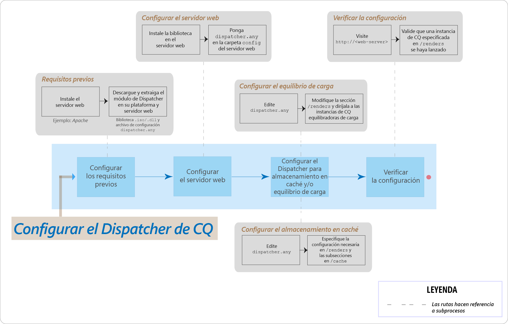

# Preguntas más frecuentes sobre los problemas principales de AEM Dispatcher



## Introducción

### ¿Qué es el despachante?

Dispatcher es la herramienta de almacenamiento en caché o equilibrio de carga de Adobe Experience Manager que ayuda a crear un entorno de creación web rápido y dinámico. Para almacenamiento en caché, Dispatcher funciona como parte de un servidor HTTP, como Apache, con el objetivo de almacenar (o "almacenar en caché") la mayor parte del contenido del sitio web estático posible y acceder al motor de diseño del sitio web con la menor frecuencia posible. En una función de equilibrio de carga, Dispatcher distribuye las solicitudes de usuario (carga) entre distintas instancias de AEM (procesamientos).

Para el almacenamiento en caché, el módulo Dispatcher utiliza la capacidad del servidor Web para proporcionar contenido estático. El despachante coloca los documentos en caché en la raíz del documento del servidor Web.

### ¿Cómo realiza el despachante el almacenamiento en caché?

Dispatcher utiliza la capacidad del servidor web para proporcionar contenido estático. Dispatcher almacena documentos en caché en la raíz del documento del servidor web. Dispatcher tiene dos métodos principales para actualizar el contenido de la caché cuando se realizan cambios en el sitio web.

* **Las actualizaciones de contenido** eliminan las páginas que han cambiado, así como los archivos que están directamente asociados a ellas.
* **La invalidación automática** invalida automáticamente las partes de la caché que pueden estar desactualizadas tras una actualización. Por ejemplo, marca efectivamente las páginas relevantes como obsoletas, sin eliminar nada.

### ¿Cuáles son los beneficios del equilibrio de carga?

Equilibrio de carga distribuye solicitudes de usuario (carga) en varias instancias de AEM.En la siguiente lista se describen las ventajas del equilibrio de carga:

* **Mayor potencia** de procesamiento: En la práctica, esto significa que Dispatcher comparte solicitudes de documento entre varias instancias de AEM. Dado que cada instancia tiene menos documentos para procesar, los tiempos de respuesta son más rápidos. Dispatcher guarda estadísticas internas de cada categoría de documento, de modo que puede estimar la carga y distribuir las consultas de forma eficaz.
* **Mayor cobertura** de seguridad contra fallos: Si el despachante no recibe respuestas de una instancia, reenviará automáticamente solicitudes a una de las otras instancias. Por lo tanto, si una instancia deja de estar disponible, el único efecto es una ralentización del sitio, proporcional a la potencia de cálculo perdida.

>[!NOTE]
>
>Para obtener más información, consulte la página Información general de [despachante](dispatcher.md)

## Instalar y configurar

### ¿De dónde puedo descargar el módulo Dispatcher?

Puede descargar el módulo Dispatcher más reciente desde la página Notas [de revisión de](release-notes.md) Dispatcher.

### ¿Cómo instalo el módulo Dispatcher?

Consulte la página [Instalación de Dispatcher](dispatcher-install.md)

### ¿Cómo configuro el módulo Dispatcher?

Consulte la página [Configuración de Dispatcher](dispatcher-configuration.md) .

### ¿Cómo configuro Dispatcher para la instancia de creación?

Consulte [Uso de Dispatcher con una instancia](dispatcher.md#using-a-dispatcher-with-an-author-server) de autor para ver los pasos detallados.

### ¿Cómo configuro Dispatcher con varios dominios?

Puede configurar CQ Dispatcher con varios dominios, siempre que los dominios cumplan las siguientes condiciones:

* El contenido web de ambos dominios se almacena en un único repositorio de AEM
* Los archivos de la caché de Dispatcher se pueden invalidar por separado para cada dominio

Lea [Uso de Dispatcher con varios dominios](dispatcher-domains.md) para obtener más información.

### ¿Cómo configuro Dispatcher para que todas las solicitudes de un usuario se dirijan a la misma instancia de Publish?

Puede utilizar la función de conexiones [](dispatcher-configuration.md#identifying-a-sticky-connection-folder-stickyconnectionsfor) fijas, que garantiza que todos los documentos de un usuario se procesen en la misma instancia de AEM. Esta función es importante si se utilizan páginas personalizadas y datos de sesión. Los datos se almacenan en la instancia. Por lo tanto, las solicitudes posteriores del mismo usuario deben volver a esa instancia o se pierden los datos.

Debido a que las conexiones adhesivas restringen la capacidad del despachante para optimizar las solicitudes, debe utilizar este método solo cuando sea necesario. Puede especificar la carpeta que contiene los documentos "adhesivos", asegurándose así de que todos los documentos de esa carpeta se procesen en la misma instancia para un usuario.

### ¿Puedo utilizar conexiones adhesivas y almacenamiento en caché en tándem?

Para la mayoría de las páginas que utilizan conexiones adhesivas, debe desactivar el almacenamiento en caché. De lo contrario, se muestra la misma instancia de la página a todos los usuarios, independientemente del contenido de la sesión.

Para algunas aplicaciones, puede ser posible utilizar tanto conexiones adhesivas como almacenamiento en caché. Por ejemplo, si se muestra un formulario que escribe datos en una sesión, se pueden utilizar conexiones adhesivas y almacenamiento en caché conjuntamente.

### ¿Pueden residir una instancia de Dispatcher y una de AEM Publish en el mismo equipo físico?

Sí, si la máquina es suficientemente poderosa. Sin embargo, se recomienda configurar la instancia de Dispatcher y AEM Publish en diferentes equipos.

Normalmente, la instancia de Publish reside dentro del servidor de seguridad y Dispatcher reside en la DMZ. Si decide que la instancia de Publish y Dispatcher están en el mismo equipo físico, asegúrese de que la configuración del cortafuegos prohíba el acceso directo a la instancia de Publish desde redes externas.

### ¿Puedo almacenar en caché solo archivos con extensiones específicas?

Sí. Por ejemplo, si desea almacenar en caché únicamente archivos GIF, especifique *.gif en la sección de caché del distribuidor.cualquier archivo de configuración.

### ¿Cómo elimino archivos de la caché?

Puede eliminar archivos de la caché mediante una solicitud HTTP. Cuando se recibe la solicitud HTTP, Dispatcher elimina los archivos de la caché. Dispatcher vuelve a almacenar en caché los archivos solo cuando recibe una solicitud de cliente para la página. La eliminación de archivos en caché de este modo es adecuada para los sitios Web que no tienen probabilidad de recibir solicitudes simultáneas para la misma página.

La solicitud HTTP tiene la sintaxis siguiente:

```
POST /dispatcher/invalidate.cache HTTP/1.1
CQ-Action: Activate
CQ-Handle: path-pattern
Content-Length: 0
```

Dispatcher elimina los archivos en caché y las carpetas que tienen nombres que coinciden con el valor del encabezado CQ-Handle. Por ejemplo, un control CQ de `/content/geomtrixx-outdoors/en` coincide con los siguientes elementos:

Todos los archivos (de cualquier extensión de archivo) nombrados en en el directorio geometrixx-outdoorsCualquier directorio llamado `_jcr_content` debajo del directorio en (que, si existe, contiene representaciones en caché de los subnodos de la página)El directorio en sólo se eliminará si `CQ-Action` es `Delete` o `Deactivate`.

Para obtener más información sobre este tema, consulte Invalidación [manual de la caché](page-invalidate.md)del despachante.

### ¿Cómo se implementa el almacenamiento en caché que distingue permisos?

Consulte la página [Almacenamiento en caché de contenido](permissions-cache.md) seguro.

### ¿Cómo puedo asegurar las comunicaciones entre las instancias de Dispatcher y CQ?

Consulte la lista [de comprobación de seguridad de](security-checklist.md) Dispatcher y las páginas de la lista [de comprobación de seguridad de](https://helpx.adobe.com/experience-manager/6-4/sites/administering/using/security-checklist.html) AEM.

### Problema de Dispatcher `jcr:content` cambiado a `jcr%3acontent`

**Pregunta**: Recientemente hemos enfrentado un problema en el nivel de despachante, donde una de las llamadas ajax que recibía algunos datos del repositorio de CQ tenía `jcr:content` en él y que se codificó para `jcr%3acontent` resultar en un resultado incorrecto.

**Respuesta**: Utilice `ResourceResolver.map()` el método para obtener una URL 'fácil de usar' o emitir para obtener solicitudes de y también para resolver el problema de almacenamiento en caché con Dispatcher. El método map() codifica los `:` dos puntos en caracteres de subrayado y el método resolve() los decodifica de nuevo en formato legible JCR SLING.Debe utilizar el método map() para generar la URL que se utiliza en la llamada de Ajax.

Más información: [https://sling.apache.org/documentation/the-sling-engine/mappings-for-resource-resolution.html#namespace-mangling](https://sling.apache.org/documentation/the-sling-engine/mappings-for-resource-resolution.html#namespace-mangling)

## Vaciar el despachante

### ¿Cómo configuro los agentes de vaciado de Dispatcher en una instancia de Publish?

Consulte la página [Replicación](https://helpx.adobe.com/content/help/en/experience-manager/6-4/sites/deploying/using/replication.html#ConfiguringyourReplicationAgents) .

### ¿Cómo se solucionan los problemas de vaciado de Dispatcher?

[Consulte este artículo](https://helpx.adobe.com/content/help/en/experience-manager/kb/troubleshooting-dispatcher-flushing-issues.html) de solución de problemas que responde a las siguientes preguntas:

* ¿Cómo debo depurar una situación en la que no se está guardando contenido en la caché de Dispatcher?
* ¿Cómo se depura una situación en la que los archivos de caché no se actualizan?
* ¿Cómo se depura una situación en la que no funciona nada relacionado con el vaciado de Dispatcher?

Si las operaciones de eliminación están causando que el despachante se vacíe, [utilice la solución alternativa en esta publicación de blog de la comunidad de Sensei Martin](https://mkalugin-cq.blogspot.in/2012/04/i-have-been-working-on-following.html).

### ¿Cómo vacio los recursos DAM de la caché de Dispatcher?

Puede utilizar la función de "replicación en cadena".  Con esta función habilitada, el agente de vaciado del despachante envía una solicitud de vaciado cuando se recibe una replicación del autor.

Para habilitarlo:

1. [Siga estos](page-invalidate.md#invalidating-dispatcher-cache-from-a-publishing-instance) pasos para crear agentes de vaciado al publicar
1. Vaya a la configuración de cada uno de esos agentes y, en la ficha **Activadores** , marque la casilla **Al recibir** .

## Varios

¿Cómo determina el despachante si un documento está actualizado?
Para determinar si un documento está actualizado, el despachante realiza estas acciones:

Comprueba si el documento depende de la invalidación automática. Si no depende de ello, considera que el documento está actualizado.
Si el documento está configurado para la invalidación automática, Dispatcher comprueba si es anterior o posterior a la fecha del último cambio disponible. Si es anterior, Dispatcher solicita la versión actual a la instancia de AEM y reemplaza la versión en la caché.

### ¿Cómo devuelve el despachante los documentos?

Puede definir si Dispatcher almacena en caché un documento mediante el [archivo de configuración](dispatcher-configuration.md) de Dispatcher `dispatcher.any`. Dispatcher comprueba la solicitud con la lista de documentos que se pueden almacenar en caché. Si el documento no está en esta lista, Dispatcher solicita el documento a la instancia de AEM.

La `/rules` propiedad controla qué documentos se almacenan en caché según la ruta del documento. Independientemente de la `/rules` propiedad, Dispatcher nunca almacena en caché un documento en las siguientes circunstancias:

* Si el URI de la solicitud contiene el signo de interrogación `(?)`.
* Esto generalmente indica una página dinámica, como un resultado de búsqueda que no necesita almacenarse en caché.
* Si falta la extensión del archivo.
* El servidor web necesita la extensión para determinar el tipo de documento (el tipo MIME).
* Si el encabezado de autenticación está establecido (esto se puede configurar)
* Si la instancia de AEM responde con los siguientes encabezados:
   * no-cache
   * sin almacén
   * must-revalidate

Dispatcher almacena archivos en caché en el servidor web como si formaran parte de un sitio web estático. Si un usuario solicita un documento en caché, el despachante comprueba si el documento existe en el sistema de archivos del servidor web. Si es así, Dispatcher devuelve los documentos. En caso contrario, Dispatcher solicita el documento a la instancia de AEM.

>[!NOTE]
>
>Dispatcher puede almacenar en caché los métodos GET o HEAD (para el encabezado HTTP). For additional information on response header caching, see the [Caching HTTP Response Headers](dispatcher-configuration.md#caching-http-response-headers) section.

### ¿Puedo implementar varios despachantes en una configuración?

Sí. En estos casos, asegúrese de que ambos despachantes puedan acceder directamente al sitio web de AEM. Un despachante no puede gestionar solicitudes procedentes de otro despachante.

