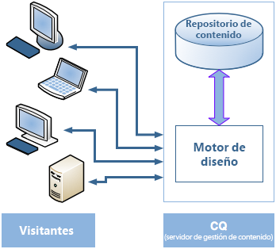
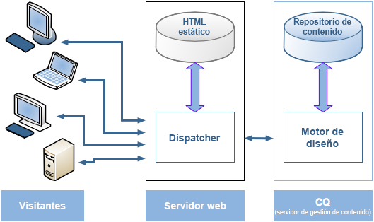
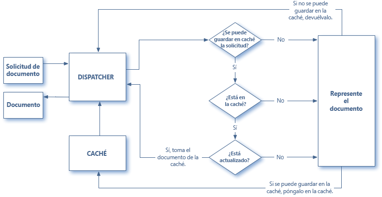
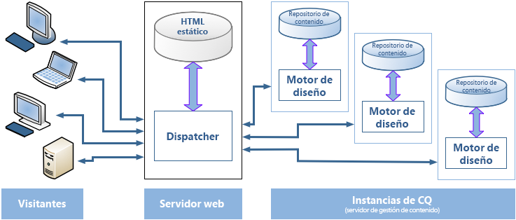

# Información general de Dispatcher {#dispatcher-overview}

>[!NOTE]
>
>Las versiones de Dispatcher son independientes de AEM. Es posible que se le haya redirigido a esta página si ha seguido un vínculo a la documentación de Dispatcher insertado en la documentación de una versión anterior de AEM.

Dispatcher es una herramienta de equilibrio de carga y almacenamiento en caché de Adobe Experience Manager que se utiliza con un servidor web de clase empresarial.

El proceso de implementación de Dispatcher es independiente del servidor web y de la plataforma del sistema operativo elegida:

1. Obtenga información sobre Dispatcher (esta página). Consulte también [preguntas más frecuentes sobre Dispatcher](https://experienceleague.adobe.com/docs/experience-manager-dispatcher/using/troubleshooting/dispatcher-faq.html?lang=en).
1. Instale un [servidor web admitido](https://experienceleague.adobe.com/docs/experience-manager-65/deploying/introduction/technical-requirements.html?lang=es) según la documentación del servidor web.
1. [Instale el módulo de Dispatcher](dispatcher-install.md) en el servidor web y configure ese servidor web en consecuencia.
1. [Configure Dispatcher](dispatcher-configuration.md) (mediante el archivo dispatcher.any).
1. [Configure AEM](page-invalidate.md) para que las actualizaciones de contenido invaliden la caché.

>[!NOTE]
>
>Para comprender mejor cómo funciona Dispatcher con AEM:
>
>* Consulte [Preguntas a los expertos de la comunidad de AEM para julio de 2017](https://communities.adobeconnect.com/pf0gem7igw1f/).
>* Acceda a [este repositorio](https://github.com/adobe/aem-dispatcher-experiments). Contiene una colección de experimentos en formato de laboratorio &quot;para llevar a casa&quot;.


Utilice la siguiente información según sea necesario:

* [Lista de comprobación de seguridad de Dispatcher](security-checklist.md)
* [Base de conocimientos de Dispatcher](https://helpx.adobe.com/experience-manager/kb/index/dispatcher.html)
* [Optimizar un sitio web para el rendimiento de la caché](https://experienceleague.adobe.com/docs/experience-manager-64/deploying/configuring/configuring-performance.html?lang=en)
* [Utilizar Dispatcher con varios dominios](dispatcher-domains.md)
* [Utilizar SSL con Dispatcher](dispatcher-ssl.md)
* [Implementar el almacenamiento en caché con permisos confidenciales](permissions-cache.md)
* [Solución de problemas de Dispatcher](dispatcher-troubleshooting.md)
* [Preguntas más frecuentes sobre los problemas principales de Dispatcher](dispatcher-faq.md)

>[!NOTE]
>
>**Generalmente, Dispatcher se utiliza** para copiar en la caché las respuestas de las **instancias publicadas** en AEM, para aumentar así la capacidad de respuesta y seguridad de su sitio web público. La mayor parte de la información se centra en este caso.
>
>Sin embargo, Dispatcher también puede utilizarse para aumentar la capacidad de respuesta de la **instancia de autor**, especialmente si tiene un gran número de usuarios editando y actualizando el sitio web. Para obtener detalles específicos sobre este caso, consulte a continuación [Uso de Dispatcher con un servidor de autor](#using-a-dispatcher-with-an-author-server).

## ¿Por qué utilizar Dispatcher para implementar el almacenamiento en caché? {#why-use-dispatcher-to-implement-caching}

Existen dos enfoques básicos para la publicación web:

* **Servidores web estáticos**: como Apache o IIS, son simples, pero rápidos.
* **Servidores de administración de contenido**: proporcionan un contenido dinámico, en tiempo real e inteligente, pero necesitan más tiempo de cálculo y otros recursos.

Dispatcher le ayudará a crear un entorno rápido y dinámico. Funciona como parte de un servidor HTML estático, como Apache, con el objetivo de:

* guardar (o &quot;almacenar en caché&quot;) todo el contenido posible del sitio en forma de un sitio web estático.
* Acceder al motor de diseño lo menos posible.

Lo que significa que:

* **contenido estático** se gestiona con la misma velocidad y facilidad que en un servidor web estático. Además, puede utilizar las herramientas de administración y seguridad disponibles para sus servidores web estáticos.

* el **contenido dinámico** se genera según sea necesario, sin ralentizar el sistema más de lo absolutamente necesario.

Dispatcher contiene mecanismos para generar y actualizar HTML estático basado en el contenido del sitio dinámico. Puede especificar con detalle qué documentos se han guardado como archivos estáticos y cuáles se crean siempre de manera dinámica.

En esta sección se ilustran los principios en que se basa este proceso.

### Servidor web estático {#static-web-server}


Un servidor web estático, como Apache o IIS, proporciona archivos HTML estáticos a los visitantes de su sitio web. Las páginas estáticas se crean una vez, por lo que se entrega el mismo contenido para cada solicitud.

Este proceso es sencillo y eficiente. Si un visitante solicita un archivo como una página de HTML, el archivo se toma directamente de la memoria; en el peor de los casos, se lee de la unidad local. Los servidores web estáticos han estado disponibles durante bastante tiempo, por lo que existe una amplia gama de herramientas para la administración y la gestión de la seguridad, y están bien integrados con las infraestructuras de red.

### Servidores de administración de contenido {#content-management-servers}



Si utiliza un CMS (Content Management Server), como AEM, un motor de diseño avanzado procesa la solicitud de un visitante. El motor lee el contenido desde un repositorio que, combinado con estilos, formatos y derechos de acceso, transforma el contenido en un documento que se adapta a las necesidades y derechos del visitante.

Este flujo de trabajo le permite crear contenido dinámico más rico, lo que aumenta la flexibilidad y funcionalidad del sitio web. Sin embargo, el motor de diseño requiere más potencia de procesamiento que un servidor estático, por lo que esta configuración puede resultar más lenta si muchos visitantes utilizan el sistema.

## Cómo realiza Dispatcher el almacenamiento en caché {#how-dispatcher-performs-caching}



**Directorio de caché**: para realizar el almacenamiento en caché, el módulo de Dispatcher utiliza la capacidad del servidor web para proporcionar contenido estático. Así pues, Dispatcher coloca los documentos guardados en la caché en la raíz del documento del servidor web.

>[!NOTE]
>
>Cuando no hay configuración para el almacenamiento en caché de encabezados HTTP, Dispatcher almacena únicamente el código HTML de la página, pero no almacena los encabezados HTTP. Este escenario puede suponer un problema si utiliza diferentes codificaciones en el sitio web, ya que estas páginas podrían perderse. Para habilitar el almacenamiento en caché de encabezados HTTP, consulte [Configuración de la caché de Dispatcher.](https://experienceleague.adobe.com/docs/experience-manager-dispatcher/using/configuring/dispatcher-configuration.html?lang=es)

>[!NOTE]
>
>La ubicación de la raíz del documento de su servidor web en el almacenamiento conectado a la red (NAS) provoca una degradación del rendimiento. Además, cuando se comparte una raíz de documento en NAS entre varios servidores web, pueden producirse bloqueos intermitentes cuando se realizan acciones de replicación.

>[!NOTE]
>
>Dispatcher almacena el documento en la caché en una estructura igual a la dirección URL solicitada.
>
>Puede haber limitaciones de nivel del sistema operativo para la longitud del nombre de archivo. Es decir, si tiene una URL con numerosos selectores.

### Métodos de almacenamiento en caché

Dispatcher tiene dos métodos principales para actualizar el contenido de la caché cuando se realizan cambios en el sitio web.

* **Actualizaciones de contenido** elimine las páginas que han cambiado y los archivos que estén directamente asociados a ellas.
* **La invalidación automática** invalida automáticamente las partes de la caché que pueden estar desactualizadas tras una actualización. Es decir, marca efectivamente las páginas relevantes como desactualizadas, sin eliminar nada.

### Actualizaciones de contenido

En una actualización de contenido, cambian uno o varios documentos AEM. AEM envía una solicitud de distribución a Dispatcher, que actualiza la caché en consecuencia:

1. Elimina los archivos modificados de la caché.
1. Elimina de la caché todos los archivos que comiencen con el mismo identificador. Por ejemplo, si se actualiza el archivo /en/index.html, se eliminarán todos los archivos que empiecen por /en/index. . Este mecanismo le permite diseñar sitios eficientes en la caché, especialmente sobre la navegación de imágenes.
1. It *toques* el **statfile**, que actualiza la marca de tiempo del archivo de estado para indicar la fecha del último cambio.

Es necesario señalar los siguientes puntos:

* Las actualizaciones de contenido se utilizan normalmente con un sistema de creación que &quot;sabe&quot; qué se debe reemplazar.
* Se eliminan los archivos afectados con una actualización de contenido, pero no se reemplazan inmediatamente. La próxima vez que se solicite un archivo de este tipo, Dispatcher recupera el nuevo archivo de la instancia de AEM y lo coloca en la caché, sobrescribiendo el contenido antiguo.
* En general, las imágenes creadas automáticamente y que contengan texto de una página se guardan en archivos de imagen que comiencen por el mismo identificador. De esa manera, se garantiza que exista la asociación para poder realizar la eliminación. Por ejemplo, puede guardar el texto de título de la página mypage.html como la imagen mypage.titlePicture.gif en la misma carpeta. De este modo, la imagen se elimina automáticamente de la caché cada vez que se actualiza la página, por lo que puede estar seguro de que la imagen siempre reflejará la versión actual de la página.
* Puede tener varios archivos de estado, por ejemplo, uno por carpeta de idioma. Si se actualiza una página, AEM busca la siguiente carpeta principal que contenga un archivo de estado y que *afecte* a dicho archivo.

### Invalidación automática

La invalidación automática invalida automáticamente partes de la caché, sin eliminar físicamente ningún archivo. En cada actualización de contenido, se modifica el llamado archivo de estado, por lo que la marca de tiempo reflejará la última actualización de contenido.

Dispatcher tiene una lista de archivos que están sujetos a la invalidación automática. Cuando se solicita un documento de esa lista, Dispatcher compara la fecha del documento en caché con la marca de tiempo del archivo de estado:

* si el documento en caché es más reciente, Dispatcher lo devuelve.
* si es anterior, Dispatcher recupera la versión actual de la instancia de AEM.

Cabe señalar también algunos puntos:

* La invalidación automática se suele utilizar cuando las interrelaciones son complejas, como las páginas del HTML. Estas páginas contienen vínculos y entradas de navegación, por lo que normalmente deben actualizarse después de actualizar el contenido. Si ha generado automáticamente archivos de PDF o de imagen, puede optar por invalidar automáticamente esos archivos también.
* La invalidación automática no implica ninguna acción por parte de Dispatcher en el momento de la actualización, excepto al tocar el archivo de estado. Sin embargo, al modificar el archivo de estado automáticamente, el contenido de la caché queda obsoleto y no se puede eliminar físicamente de la misma.

## Cómo devuelve documentos Dispatcher {#how-dispatcher-returns-documents}



### Determinar si un documento está sujeto al almacenamiento en caché

Puede [definir qué documentos almacena en caché Dispatcher en el archivo de configuración](https://experienceleague.adobe.com/docs/experience-manager-dispatcher/using/configuring/dispatcher-configuration.html?lang=es). Dispatcher comprueba la solicitud con la lista de documentos que se pueden almacenar en caché. Si el documento no está en esta lista, Dispatcher solicita el documento a la instancia de AEM.

Dispatcher siempre solicita el documento directamente desde la instancia de AEM en los siguientes casos:

* El URI de la solicitud contiene un signo de interrogación &quot;`?`&quot;. Este escenario normalmente indica una página dinámica, como un resultado de búsqueda, que no necesita almacenarse en caché.
* Si falta la extensión del archivo. El servidor web necesita la extensión para determinar el tipo de documento (el tipo MIME).
* El encabezado de autenticación está establecido (configurable).

>[!NOTE]
>
>Dispatcher puede almacenar en caché los métodos GET o HEAD (para el encabezado HTTP). Para obtener información adicional sobre el almacenamiento en caché de encabezados de respuesta, consulte la sección [Almacenamiento en caché de encabezados de respuesta HTTP](https://experienceleague.adobe.com/docs/experience-manager-dispatcher/using/configuring/dispatcher-configuration.html?lang=es).

### Determinar si un documento está almacenado en la caché

Dispatcher almacena los archivos en la caché del servidor web como si fueran parte de un sitio web estático. Si un usuario solicita un documento almacenable en caché, Dispatcher comprueba si dicho documento existe en el sistema de archivos del servidor web:

* si el documento está en la caché, Dispatcher devuelve el archivo.
* si no está en la caché, Dispatcher solicita el documento a la instancia de AEM.

### Determinar si un documento está actualizado

Para saber si un documento está actualizado, Dispatcher realiza dos acciones:

1. Comprueba si el documento depende de la invalidación automática. Si no depende de ello, considera que el documento está actualizado.
1. Si el documento está configurado para la invalidación automática, Dispatcher comprueba si es anterior o posterior a la fecha del último cambio disponible. Si es anterior, Dispatcher solicita la versión actual a la instancia de AEM y reemplaza la versión en la caché.

>[!NOTE]
>
>Documentos sin **invalidación automática** permanezca en la caché hasta que se eliminen físicamente. Por ejemplo, mediante una actualización de contenido en el sitio web.

## Las ventajas del equilibrio de carga {#the-benefits-of-load-balancing}

Equilibrio de carga es la práctica de distribuir la carga de cálculo del sitio web en varias instancias de AEM.



Se obtiene lo siguiente:

* **mayor potencia de procesamiento**
En la práctica, el aumento de la potencia de procesamiento significa que Dispatcher comparte solicitudes de documento entre varias instancias de AEM. Dado que cada instancia tiene ahora menos documentos para procesar, los tiempos de respuesta son más rápidos. Dispatcher guarda estadísticas internas de cada categoría de documento, de modo que puede estimar la carga y distribuir las consultas de forma eficaz.

* **mayor cobertura de seguridad contra fallos**
Si Dispatcher no recibe respuestas de una instancia, envía automáticamente solicitudes a una de las otras instancias. Si una instancia deja de estar disponible, el único efecto es una ralentización del sitio, proporcional a la potencia de cálculo perdida. Sin embargo, todos los servicios continúan.

* También puede administrar diferentes sitios web en el mismo servidor web estático.

>[!NOTE]
>
>Mientras que el equilibrio de carga distribuye la carga de forma eficaz, el almacenamiento en caché ayudará a reducir esa carga. Por lo tanto, intente optimizar el almacenamiento en caché y reducir la carga total antes de configurar el equilibrio de carga. Un buen almacenamiento en caché puede aumentar el rendimiento del equilibrador de carga o hacer innecesario el equilibrio de carga.

>[!CAUTION]
>
>Aunque un solo Dispatcher puede saturar la capacidad de las instancias de publicación disponibles, para algunas aplicaciones excepcionales también tiene sentido equilibrar la carga entre dos instancias de Dispatcher. Las configuraciones con varios Dispatcher deben considerarse cuidadosamente, ya que un Dispatcher adicional puede aumentar la carga en las instancias de publicación disponibles y puede reducir fácilmente el rendimiento en la mayoría de las aplicaciones.

## Cómo realiza Dispatcher el equilibrio de carga {#how-the-dispatcher-performs-load-balancing}

### Estadísticas de rendimiento

Dispatcher mantiene estadísticas internas sobre la rapidez con la que cada instancia de AEM procesa los documentos. En función de estos datos, Dispatcher calcula qué instancia puede proporcionar el tiempo de respuesta más rápido al responder una solicitud y, por lo tanto, se reserva el tiempo de cálculo necesario en ese caso.

Los distintos tipos de solicitudes pueden tener diferentes tiempos de finalización promedio, por lo que Dispatcher permite especificar categorías de documentos. Estas categorías se tienen en cuenta al calcular las estimaciones de tiempo. Por ejemplo, puede distinguir entre páginas de HTML e imágenes, ya que los tiempos de respuesta típicos bien pueden diferir.

Si utiliza una función de búsqueda detallada, puede crear una categoría para las consultas de búsqueda. Este método ayuda a Dispatcher a enviar consultas de búsqueda a la instancia que responde con mayor rapidez. También ayuda a evitar que una instancia más lenta se detenga cuando recibe varias consultas de búsqueda &quot;costosas&quot;, mientras que las demás reciben las solicitudes &quot;más baratas&quot;.

### Contenido personalizado (conexiones duraderas)

Las conexiones duraderas garantizan que todos los documentos de un usuario se compongan en la misma instancia de AEM. Este punto es importante si utiliza páginas personalizadas y datos de sesión. Los datos se almacenan en la instancia, por lo que las solicitudes posteriores del mismo usuario deben volver a esa instancia o se perderán los datos.

Como las conexiones duraderas restringen la capacidad de Dispatcher para optimizar las solicitudes, debe utilizarlas únicamente cuando sea necesario. Puede especificar la carpeta que contiene los documentos &quot;duraderos&quot;, asegurándose así de que todos los documentos de esa carpeta se compongan en la misma instancia para cada usuario.

>[!NOTE]
>
>Asimismo, debe desactivar el almacenamiento en caché de la mayoría de las páginas que usen conexiones duraderas; de lo contrario, la página tendrá el mismo aspecto para todos los usuarios, independientemente del contenido de la sesión.
>
>Si se usan *menos* aplicaciones, se pueden utilizar tanto la conexión duradera como el almacenamiento en caché; por ejemplo, si muestra un formulario que escriba datos en la sesión.

## Utilizar varias instancias de Dispatcher {#using-multiple-dispatchers}

En configuraciones complejas, puede utilizar varias instancias de Dispatcher. Por ejemplo, puede utilizar:

* una instancia de Dispatcher para publicar un sitio web en la Intranet
* una segunda instancia de Dispatcher, en una dirección y con una configuración de seguridad diferentes, para publicar el mismo contenido en Internet.

En ese caso, asegúrese de que cada solicitud pasa por una única instancia de Dispatcher. Una instancia de Dispatcher no administra solicitudes procedentes de otra instancia de Dispatcher. Por lo tanto, asegúrese de que ambas instancias de Dispatcher acceden directamente al sitio web de AEM.

## Utilizar Dispatcher con una CDN {#using-dispatcher-with-a-cdn}

Una red de entrega de contenido (CDN), como Akamai Edge Delivery o Amazon Cloud Front, ofrece contenido desde una ubicación cercana al usuario final. Por eso

* se aceleran los tiempos de respuesta de los usuarios finales
* se quita carga de los servidores

Como componente de infraestructura HTTP, una CDN funciona como Dispatcher. Cuando un nodo de CDN recibe una solicitud, esta se suministra desde su caché, si es posible (el recurso está disponible en la caché y es válido). De lo contrario, se dirige al siguiente servidor más cercano para recuperar el recurso y almacenarlo en la caché para solicitudes adicionales, si procede.

El &quot;siguiente servidor más cercano&quot; depende de la configuración específica. Por ejemplo, en una configuración de Akamai, la solicitud puede seguir la siguiente ruta:

* El nodo perimetral Akamai
* La capa Akamai Midgres
* Su cortafuegos
* Su equilibrador de carga
* Dispatcher
* AEM

Normalmente, Dispatcher es el siguiente servidor que puede servir el documento desde una caché e influir en los encabezados de respuesta devueltos al servidor CDN.

## Controlar una caché de CDN {#controlling-a-cdn-cache}

Existen varias formas de controlar durante cuánto tiempo una CDN almacena en caché un recurso antes de recuperarlo de Dispatcher.

1. Configuración explícita\
   Configure cuánto tiempo se retienen recursos concretos en la caché de la CDN, según el tipo de MIME, la extensión, el tipo de solicitud, etc.

1. Caducidad y encabezados de control de caché\
   La mayoría de las CDN respetan `Expires:` y `Cache-Control:` Encabezados HTTP si los envía el servidor de flujo ascendente. Este método se puede lograr, por ejemplo, utilizando la variable [mod_expires](https://httpd.apache.org/docs/2.4/mod/mod_expires.html) Módulo Apache.

1. Invalidación manual\
   Las CDN permiten que los recursos se eliminen de la caché a través de interfaces web.
1. Invalidación basada en API\
   La mayoría de los CDN también ofrecen una API de REST o SOAP que permite eliminar recursos de la caché.

En una configuración de AEM típica, la configuración por extensión, por ruta o por ambas opciones (que se puede lograr a través de los puntos 1 y 2 anteriores) ofrece la posibilidad de establecer períodos razonables de almacenamiento en caché para recursos que se utilizan con frecuencia y que no cambian con frecuencia, como imágenes de diseño y bibliotecas de cliente. Cuando se implementan nuevas versiones, generalmente se requiere una invalidación manual.

Si este método se utiliza para almacenar en caché el contenido administrado, implica que los cambios de contenido solo son visibles para los usuarios finales una vez que el período de almacenamiento en caché configurado haya caducado y se recupere el documento de Dispatcher.

Para un control más preciso, la invalidación basada en API permite invalidar la caché de una CDN, ya que la caché de Dispatcher se invalida. En función de la API de CDN, puede implementar su propio [ContentBuilder](https://developer.adobe.com/experience-manager/reference-materials/6-5/javadoc/com/day/cq/replication/ContentBuilder.html) y [TransportHandler](https://developer.adobe.com/experience-manager/reference-materials/6-5/javadoc/com/day/cq/replication/TransportHandler.html) (si la API no está basada en REST) y configure un agente de replicación que utilice estos elementos para invalidar la caché de la CDN.

>[!NOTE]
>
>Consulte también [AEM (CQ) seguridad de Dispatcher y CDN + Explorador de almacenamiento en caché](https://www.slideshare.net/andrewmkhoury/dispatcher-caching-aemgemspart2jan2015) y la presentación grabada en [Almacenamiento en caché de Dispatcher](https://experienceleague.adobe.com/docs/experience-manager-gems-events/gems/gems2015/aem-dispatcher-caching-new-features-and-optimizations.html?lang=en).

## Utilizar Dispatcher con un servidor de creación {#using-a-dispatcher-with-an-author-server}

>[!CAUTION]
>
>Si usa [AEM con la interfaz de usuario táctil](https://experienceleague.adobe.com/docs/experience-manager-65/developing/introduction/touch-ui-concepts.html?lang=en), do **not** contenido de la instancia de creación de caché. Si el almacenamiento en caché estaba habilitado para la instancia de autor, debe deshabilitarlo y eliminar el contenido del directorio de caché. Para desactivar el almacenamiento en caché, edite la `author_dispatcher.any` y modificar el `/rule` propiedad de la variable `/cache` como se indica a continuación:

```xml
/rules
{
/0000
{ /type "deny" /glob "*"}
}
```

Dispatcher se puede utilizar delante de una instancia de autor para mejorar el rendimiento del proceso de creación. Para configurar una instancia de Dispatcher de creación, haga lo siguiente:

1. Instale un Dispatcher en un servidor web (un servidor web Apache o IIS, consulte [Instalación de Dispatcher](dispatcher-install.md)).
1. Pruebe el Dispatcher recién instalado con una instancia de publicación AEM en funcionamiento. De este modo, se garantiza que se ha alcanzado una instalación correcta para la línea de base.
1. A continuación, asegúrese de que Dispatcher pueda conectarse mediante TCP/IP a la instancia de autor.
1. Reemplazar el ejemplo `dispatcher.any` con el `author_dispatcher.any` archivo proporcionado con la variable [Descarga de Dispatcher](release-notes.md#downloads).
1. Abra `author_dispatcher.any` en un editor de texto y realice los siguientes cambios:

   1. Cambie el `/hostname` y `/port` del `/renders` para que apunten a la instancia de autor.
   1. Cambie el `/docroot` del `/cache` para que apunten a un directorio de caché. Si utiliza [AEM con la interfaz táctil de usuario](https://experienceleague.adobe.com/docs/experience-manager-65/developing/introduction/touch-ui-concepts.html?lang=en), consulte la advertencia anterior.
   1. Guarde los cambios.

1. Elimine todos los archivos existentes en el directorio `/cache` > `/docroot` que configuró anteriormente.
1. Reinicie el servidor web.

>[!NOTE]
>
>Con el `author_dispatcher.any` cuando instala un paquete de funciones CQ5, una revisión o un paquete de código de aplicación que afecta a cualquier contenido de `/libs` o `/apps`, debe eliminar los archivos en caché bajo esos directorios en la caché de Dispatcher. Al hacerlo, se garantiza que la próxima vez que se soliciten se recuperen los archivos recién actualizados y no los antiguos que se guardaron en la caché.

>[!CAUTION]
>
>Si ha utilizado el autor Dispatcher configurado anteriormente y ha habilitado un *Agente de vaciado de Dispatcher*, haga lo siguiente:

1. Elimine o deshabilite el **de Dispatcher de autor** agente de vaciado en la instancia de autor de AEM.
1. Rehaga la configuración de Dispatcher de autor siguiendo las nuevas instrucciones anteriores.

<!--
[Author Dispatcher configuration file (Dispatcher 4.1.2 or later)](assets/author_dispatchernew.any)
-->
<!--[!NOTE]
>
>A related knowledge base article can be found here:  
>[How to configure the dispatcher in front of an authoring environment](https://helpx.adobe.com/cq/kb/HowToConfigureDispatcherForAuthoringEnvironment.html)
-->
