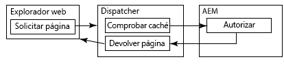
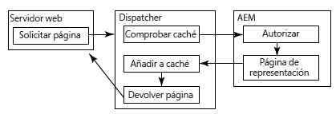
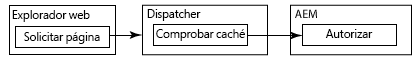

# Almacenar contenido seguro en la caché {#caching-secured-content}

El almacenamiento en caché con permisos confidenciales le permite almacenar en caché las páginas seguras. Dispatcher comprueba los permisos de acceso del usuario para una página antes de enviar la página en caché.

Dispatcher incluye el módulo AuthChecker que implementa el almacenamiento en caché con permisos confidenciales. Cuando el módulo está activado, Dispatcher llama a un servlet de AEM para realizar la autenticación del usuario y la autorización del contenido solicitado. La respuesta del servlet determina si el contenido se envía al explorador web desde la caché o no.

Como los métodos de autenticación y autorización son específicos de la implementación de AEM, es necesario crear el servlet.

>[!NOTE]
>
>Utilice filtros `deny` para aplicar restricciones generales de seguridad. Utilice el almacenamiento en caché con permisos confidenciales para páginas configuradas para permitir el acceso a un subconjunto de usuarios o grupos.

Los siguientes diagramas ilustran el orden de los eventos que se producen cuando un explorador web solicita una página para la que se utiliza el almacenamiento en caché que distingue permisos.

## La página se almacena en caché y el usuario está autorizado {#page-is-cached-and-user-is-authorized}



1. Dispatcher determina que el contenido solicitado se almacena en caché y es válido.
1. Dispatcher envía un mensaje de solicitud al procesador. La sección HEAD incluye todas las líneas de encabezado de la solicitud del explorador.
1. El procesador llama al servlet auth checker para realizar la comprobación de seguridad y responde a Dispatcher. El mensaje de respuesta incluye un código de estado HTTP de 200 para indicar que el usuario está autorizado.
1. Dispatcher envía un mensaje de respuesta al explorador que consta de las líneas de encabezado de la respuesta de procesamiento y el contenido almacenado en caché.

## La página no se almacena en caché y el usuario está autorizado {#page-is-not-cached-and-user-is-authorized}



1. Dispatcher determina que el contenido no se almacena en caché o que requiere una actualización.
1. Dispatcher reenvía la solicitud original al procesador.
1. El procesador llama al servlet AEM authorizer (que no es el servlet Dispatcher AuthChcker) para realizar una comprobación de seguridad. Cuando el usuario está autorizado, el procesamiento incluye la página representada en el cuerpo del mensaje de respuesta.
1. Dispatcher reenvía la respuesta al explorador. Dispatcher añade el cuerpo del mensaje de respuesta del procesador a la caché.

## El usuario no está autorizado {#user-is-not-authorized}



1. Dispatcher comprueba la caché.
1. Dispatcher envía un mensaje de solicitud al procesador que incluye todas las líneas de encabezado de la solicitud del explorador.
1. El procesador llama al servlet Auth Checker para realizar una comprobación de seguridad que da error y el procesador reenvía la solicitud original a Dispatcher.
1. Dispatcher reenvía la solicitud original al procesador.
1. El procesador llama al servlet AEM authorizer (que no es el servlet Dispatcher AuthChcker) para realizar una comprobación de seguridad. Cuando el usuario está autorizado, el procesamiento incluye la página representada en el cuerpo del mensaje de respuesta.
1. Dispatcher reenvía la respuesta al explorador. Dispatcher añade el cuerpo del mensaje de respuesta del procesador a la caché.

## Implementar el almacenamiento en caché con permisos confidenciales {#implementing-permission-sensitive-caching}

Para implementar el almacenamiento en caché que con permisos confidenciales, realice las siguientes tareas:

* Desarrollar un servlet que realice la autenticación y la autorización
* Configure Dispatcher

>[!NOTE]
>
>Normalmente, los recursos seguros se almacenan en una carpeta separada de los archivos no seguros. Por ejemplo, /content/secure/

>[!NOTE]
>
>Cuando hay una CDN (o cualquier otra caché) delante de Dispatcher, debe configurar los encabezados de caché en consecuencia para que la CDN no almacene en caché el contenido privado. Por ejemplo: `Header always set Cache-Control private`.
>Para AEM as a Cloud Service, consulte la página [Almacenamiento en caché](https://experienceleague.adobe.com/docs/experience-manager-cloud-service/content/implementing/content-delivery/caching.html?lang=es) para obtener más información sobre cómo establecer encabezados de almacenamiento en caché privados.

## Creación del servlet Auth Checker {#create-the-auth-checker-servlet}

Cree e implemente un servlet que realice la autenticación y la autorización del usuario que solicita el contenido web. El servlet puede utilizar cualquier método de autenticación y autorización, como la cuenta de usuario AEM y las ACL del repositorio, o un servicio de búsqueda LDAP. El servlet se implementa en la instancia de AEM que Dispatcher utiliza como procesador.

El servlet debe ser accesible para todos los usuarios. Por lo tanto, el servlet debe ampliar la clase `org.apache.sling.api.servlets.SlingSafeMethodsServlet`, que proporciona acceso de solo lectura al sistema.

El servlet solo recibe solicitudes de HEAD del procesamiento, por lo que solo necesita implementar el método `doHead`.

El procesamiento incluye el URI del recurso solicitado como parámetro de la solicitud HTTP. Por ejemplo, se accede a un servlet de autorización a través de `/bin/permissioncheck`. Para realizar una comprobación de seguridad en la página /content/geometrixx-outdoors/en.html, el procesamiento incluye la siguiente URL en la solicitud HTTP:

`/bin/permissioncheck?uri=/content/geometrixx-outdoors/en.html`

El mensaje de respuesta de servlet debe contener los siguientes códigos de estado HTTP:

* 200: Autenticación y autorización aprobadas.

El siguiente servlet de ejemplo obtiene la URL del recurso solicitado de la solicitud HTTP. El código utiliza la anotación Felix SCR `Property` para establecer el valor de la propiedad `sling.servlet.paths` en /bin/permimissioncheck. En el método `doHead`, el servlet obtiene el objeto session y utiliza el método `checkPermission` para determinar el código de respuesta adecuado.

>[!NOTE]
>
>El valor de la propiedad sling.servlet.paths debe estar habilitado en el servicio Sling Servlet Resolver (org.apache.sling.servlets.resolver.SlingServletResolver).

### Servlet de ejemplo {#example-servlet}

```java
package com.adobe.example;

import org.apache.felix.scr.annotations.Component;
import org.apache.felix.scr.annotations.Service;
import org.apache.felix.scr.annotations.Property;

import org.apache.sling.api.SlingHttpServletRequest;
import org.apache.sling.api.SlingHttpServletResponse;
import org.apache.sling.api.servlets.SlingSafeMethodsServlet;

import org.slf4j.Logger;
import org.slf4j.LoggerFactory;

import javax.jcr.Session;

@Component(metatype=false)
@Service
public class AuthcheckerServlet extends SlingSafeMethodsServlet {
 
    @Property(value="/bin/permissioncheck")
    static final String SERVLET_PATH="sling.servlet.paths";
    
    private Logger logger = LoggerFactory.getLogger(this.getClass());
    
    public void doHead(SlingHttpServletRequest request, SlingHttpServletResponse response) {
     try{ 
      //retrieve the requested URL
      String uri = request.getParameter("uri");
      //obtain the session from the request
      Session session = request.getResourceResolver().adaptTo(javax.jcr.Session.class);     
      //perform the permissions check
      try {
       session.checkPermission(uri, Session.ACTION_READ);
       logger.info("authchecker says OK");
       response.setStatus(SlingHttpServletResponse.SC_OK);
      } catch(Exception e) {
       logger.info("authchecker says READ access DENIED!");
       response.setStatus(SlingHttpServletResponse.SC_FORBIDDEN);
      }
     }catch(Exception e){
      logger.error("authchecker servlet exception: " + e.getMessage());
     }
    }
}
```

## Configure Dispatcher para el almacenamiento en caché sensible a permisos {#configure-dispatcher-for-permission-sensitive-caching}

>[!NOTE]
>
>Si sus requisitos permiten el almacenamiento en caché de documentos autenticados, establezca la propiedad /allowAuthorized en la sección /cache a `/allowAuthorized 1`. Consulte [Almacenamiento en caché cuando se utiliza la autenticación](/help/using/dispatcher-configuration.md) para obtener más información.

La sección auth_checker del archivo dispatcher.any controla el comportamiento del almacenamiento en caché sensible a permisos. La sección auth_checker incluye las siguientes subsecciones:

* `url`: El valor de la propiedad `sling.servlet.paths` del servlet que realiza la comprobación de seguridad.

* `filter`: Filtros que especifican las carpetas a las que se aplica el almacenamiento en caché con permisos confidenciales. Normalmente, se aplica un filtro `deny` a todas las carpetas y los filtros `allow` se aplican a las carpetas seguras.

* `headers`: Especifica los encabezados HTTP que incluye el servlet de autorización en la respuesta.

Cuando se inicia Dispatcher, el archivo de registro incluye el siguiente mensaje de nivel de depuración:

`AuthChecker: initialized with URL 'configured_url'.`

En el siguiente ejemplo, la sección auth_checker configura Dispatcher para que utilice el servlet del tema anterior. La sección de filtro hace que las comprobaciones de permisos se realicen solo en recursos HTML seguros.

### Ejemplo de configuración {#example-configuration}

```xml
/auth_checker
  {
  # request is sent to this URL with '?uri=<page>' appended
  /url "/bin/permissioncheck"
      
  # only the requested pages matching the filter section below are checked,
  # all other pages get delivered unchecked
  /filter
    {
    /0000
      {
      /glob "*"
      /type "deny"
      }
    /0001
      {
      /glob "/content/secure/*.html"
      /type "allow"
      }
    }
  # any header line returned from the auth_checker's HEAD request matching
  # the section below will be returned as well
  /headers
    {
    /0000
      {
      /glob "*"
      /type "deny"
      }
    /0001
      {
      /glob "Set-Cookie:*"
      /type "allow"
      }
    }
  }
```
